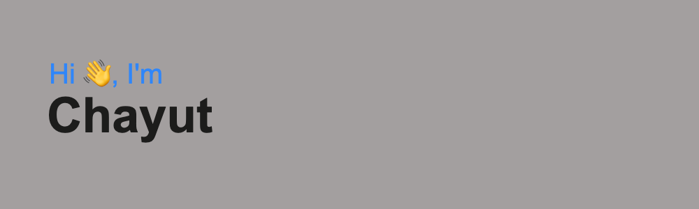

I am a full-time Senior Programmer in MEDEZE GROUP PUBLIC COMPANY LIMITED and part-time Freelance web developer and ERP system. I have started programmer since the internship and develop some web application to join some contest to get more experience then my goals are Devops improve myself to share knowledge in my team.

## 📫 Social

## 💻 My Tech Stack

#### Senior Developer

#### Framwork

<!--
**Toeikun/Toeikun** is a ✨ _special_ ✨ repository because its `README.md` (this file) appears on your GitHub profile.

Here are some ideas to get you started:

- 🔭 I’m currently working on ...
- 🌱 I’m currently learning ...
- 👯 I’m looking to collaborate on ...
- 🤔 I’m looking for help with ...
- 💬 Ask me about ...
- 📫 How to reach me: ...
- 😄 Pronouns: ...
- ⚡ Fun fact: ...
-->
